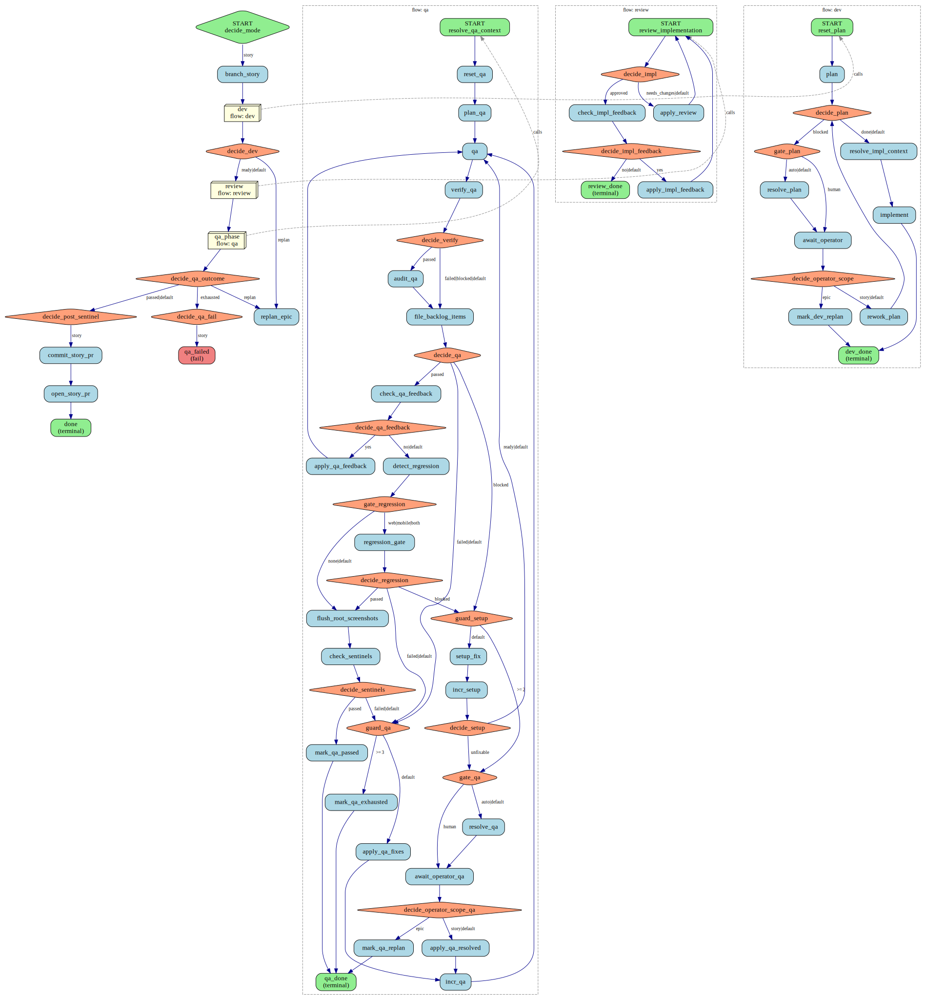
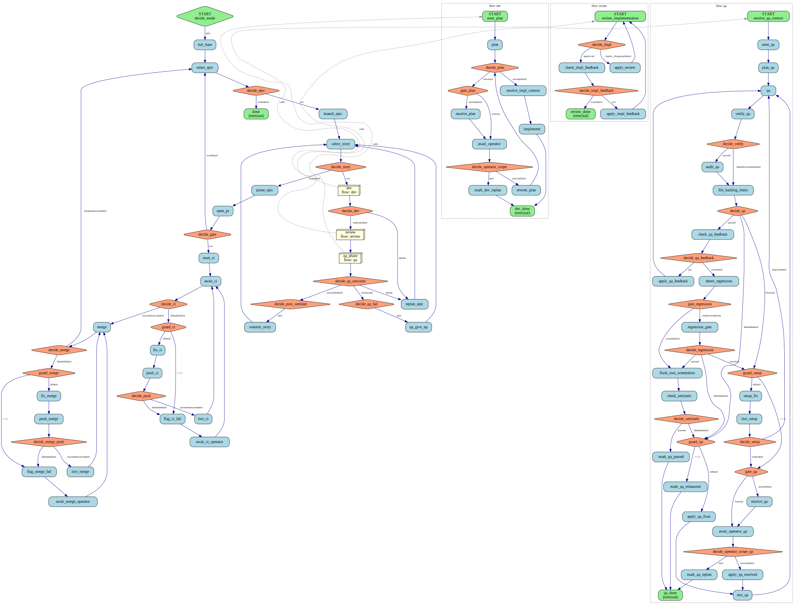

# Coder Workflow Documentation

The unified coder workflow supports two modes: **story** (single story, no queue/CI/PR) and **epic** (multi-story queue + CI/PR gating). Both modes share the core per-story stages (plan → implement → review → documentation → QA), with mode-specific routing at entry and exit points.

## Mode: story

Single-story workflow with no queue, CI gating, or PR management. Useful for:
- One-off story fixes
- Manual testing of individual changes
- Stories that don't require full epic coordination

**Entry point:** `reset_plan` (skips all queue/CI infrastructure)
**Exit points:** `done` (success) or `qa_failed` (QA exhausted without passing)



### Flow Breakdown

1. **Plan** → `plan` → `decide_plan` (no separate plan-review agent — it caught nothing in practice; depth is enforced by implementation review and, decisively, by QA)
   - Done: → `check_code_reuse` (anti-reimplementation gate) → `implement`
   - Blocked: → `gate_plan` → `await_operator` (human halt) → operator answers inline → `rework_plan` → `decide_plan`
   - Reuse rework: `check_code_reuse` finds an existing implementation the plan would rebuild → `rework_plan_reuse` re-plans to reuse it → re-check (bounded by `max_reuse_reworks`, fail-open to `implement`)

2. **Implement** → `implement` → `code_review` → `code_reuse` → `review_implementation` → `decide_impl`
   - Approved: → hard-gated OKF documentation → QA context generation
   - Needs changes: → `apply_review` → `review_implementation` (loop)

3. **Documentation** → incremental OKF authoring → deterministic context and `ostler doctor` gate → independent semantic review
   - New services, screens, components, commands, endpoints, concepts, formats, and flows must be merged into the current book
   - Surface-only code ownership, graph errors, unreadable OKF, and semantic omissions enter a bounded repair loop
   - Exhaustion or a product/author block terminates at `documentation_failed`; QA and commit cannot run
   - Repositories without an OKF `docs/features/` tree are explicitly not applicable

4. **QA** → context generation/validation → YAML planning/validation → semantic plan review → Ostler run → objective assessment → evidence gate → audit
   - `qa-plan.yml` is mandatory for command, Playwright, and Maestro surfaces
   - Ostler owns execution, cleanup, the append-only ledger, manifest, and evidence
   - the semantic reviewer checks whether each scenario can reach and observe its objective before execution
   - the execution reviewer confirms whether the completed run actually exercised that objective
   - `verify_qa_evidence` rejects malformed runner proof as `invalid`; only valid passes reach `audit_qa`
   - Passed (gate + audit): → `done` (success, terminal)
   - Failed / refuted: → `guard_qa` (max 3 reworks) → `apply_qa_fixes` → `incr_qa` →
     rebuild context and rerun the validated control plane; the fixer's self-report is never trusted
   - Max reworks exhausted: → `qa_failed` (non-zero exit)

---

## Mode: epic

Multi-story queue with CI/PR gating. The workflow walks the epic queue (`docs/epics/epics-todo.json`), commits each completed story, and gates each epic boundary on green CI before merging and branching the next epic.

**Entry point:** `init_base` → `select_story` (populate queue, select first)
**Exit point:** `done` (all epics merged and done)

**Git/PR model:** One PR per epic; every epic must go green (with bounded auto-fix) before merge.



### Flow Breakdown

1. **Queue initialization** → `init_base` → `select_story`
   - Captures the PR base branch (normally the repo's `main`)
   - Selects the first story from the epic queue

2. **Story selection loop** → `decide_story`
   - More stories: → `open_prev_pr` (if epic changed, open previous epic's PR)
   - Queue done: → `open_final_pr` (finalize the last epic)

3. **Epic boundary** (happens between epics)
   - `open_prev_pr` → `decide_prev_gate` (should we CI gate this epic?)
     - Yes: → **CI gate** (see below)
     - No: → `branch_epic` (first story in queue, no boundary yet)
   - After CI passes: `merge_prev` → `branch_epic` (merge PR, cut next epic)

4. **CI Gate** (shared by boundary and finalize paths)
   - `reset_ci` → `await_ci` → `decide_ci`
   - Green/unavailable CI: → `decide_ci_return` → `merge_prev` or `merge_final`
   - Red CI: → `guard_ci` (max 3 fix cycles) → `fix_ci` → `push_ci` → `incr_ci` (loop)
   - Max fixes exhausted: → `flag_ci_fail` → `await_ci_operator` (human halt)
   - Operator resumes: resets fix counter → `await_ci` (re-enter CI gate)

5. **Story workflow** (shared with story mode)
   - `reset_plan` → `plan` → implementation → review → hard-gated OKF documentation → QA control plane → regression/completion
   - Same context, YAML-plan, Ostler-run, evidence, and audit stages as story mode

6. **QA exit routing** (epic-specific)
   - QA passed: → `commit_story` (commit to epic branch) → `select_story` (loop to next story)
   - QA failed (max reworks): → `qa_give_up` (flag with [QA FAILED] marker) → `select_story` (loop to next story)
   - Unlike story mode: failures don't halt the queue; they're flagged and the next story runs

7. **Queue exhaustion** → `open_final_pr`
   - Opens the final epic's PR
   - Runs CI gate (same as boundary)
   - Merges final epic: → `done` (success, all epics merged)

---

## Shared Stages (Plan, Implement, Review, QA)

Both modes use the same core stages. Differences:
- **QA exit**: story mode has `done` or `qa_failed`; epic mode has `commit_story`→loop or `qa_give_up`→loop
- **Operator gates**: story mode halts; epic mode halts and can choose scope (`story` or `epic`)

### Plan Loop

```
plan (opus) → decide_plan
├─ done → seed_reuse → check_code_reuse (opus) → decide_reuse
│           ├─ ok → validate_plan → implement
│           └─ needs_rework → guard_reuse (≤ max_reuse_reworks)
│                 → rework_plan_reuse (opus, refine-plan) → check_code_reuse (loop)
└─ blocked → gate_plan → await_operator (human) / resolve_plan (auto)
              → operator answers → rework_plan (opus) → decide_plan
```

- There is **no separate plan-review agent**: a dedicated reviewer added a full opus pass per story and caught nothing actionable. Correctness is enforced by implementation review and, decisively, by QA — so the plan goes straight to `implement`.
- **Code-reuse gate** (`check_code_reuse`): before implementation, checks the approved plan against the existing codebase for a feature/endpoint/component/utility it would **re-implement**. A `needs_rework` verdict reworks the plan to reuse what exists (via `refine-plan.md`) and re-checks. It is **advisory and fail-open**: bounded by `max_reuse_reworks` (default 2) and a defaulted/exhausted check proceeds to `implement` — review and QA re-check reuse on the real diff.
- **Operators** (`plan`, `rework_plan`): use `opus` for high-stakes prod operations
- **Block gate**: only a genuine `blocked` (a dangerous/undecidable prod operation) stops the run; the operator answers inline in `<story-folder>/context.md`, then `rework_plan` re-plans and re-evaluates via `decide_plan`

### Implementation Loop

```
implement → code_review → code_reuse → review_implementation → decide_impl
├─ approved → check_impl_feedback → decide_impl_feedback
│  ├─ feedback present → apply_impl_feedback → review_implementation (loop)
│  └─ no feedback → documentation flow → QA flow
└─ needs_changes → apply_review → review_implementation (loop)
```

- **Two automated review inputs feed the reviewer** (run once per review entry, not per rework pass):
  - `code_review` — the native `/code-review` skill over each affected repo's local changes.
  - `code_reuse` — a dedicated pass hunting **duplicated code** and **missed utility/helper reuse** (the tech-debt class). Extracted out of `review_implementation` (its former "Code Duplication" / "Missed Utility" self-review dimensions) so the concern is enforced by one focused opus pass. Both results ride into `review_implementation`, which folds them into its verdict — so a Major/Critical reuse finding drives the existing `needs_changes → apply_review` rework loop rather than being filed and forgotten.
- No agent loop cap; assumes convergence through review
- `check_impl_feedback` is a **non-blocking** poll of `<spec_dir>/feedback.md` (see [Non-blocking operator feedback](#non-blocking-operator-feedback)); with no feedback it falls straight through to QA

### Documentation Loop

```text
prepare_story -> resolve_documentation_context -> detect_documentation_okf
-> document_story -> build_documentation_context -> validate_documentation_context
-> verify_story_documentation -> review_story_documentation -> documentation_done
```

- `document_story` follows the scaffold → author → fmt → doctor loop and merges the story delta
  into the full current OKF contracts.
- `verify_story_documentation` fails closed on invalid context, broad surface-only ownership, or
  any error-level `ostler doctor` finding.
- When source roots share the docs Git worktree, the deterministic mapper covers repository-wide
  shared code, excludes configured document roots, and requires exact grounding for every changed
  symbol. Multi-repo and non-Git docs roots
  use doctor plus the independent semantic reviewer instead of attempting an invalid cross-repo
  `git diff` from the docs directory.
- `review_story_documentation` independently checks semantic completeness and rejects an invalid
  `not_required` claim, especially for new services and UI/API/CLI surface nodes.
- Deterministic or semantic failures loop through bounded re-authoring. Exhaustion reaches a
  `type: fail` terminal, so neither story nor epic mode can flag-and-continue past missing docs.
- The same flow runs again after QA, regression repair, and the inline fix drain. This final pass
  validates the actual working tree that will be committed, not only the pre-QA implementation.
- Epic QA give-up marker commits and standalone fix-story commits also pass through the docs flow.
  CI and merge remediation have no selected story, so those agents are contract-preserving only:
  a repair requiring observable behavior changes must fail and return to story/operator handling.
- Run this phase alone with `workhorse run coder docs --params '{"story":"CASE-1234"}'`.

### QA Loop

```text
prepare_story -> clear_qa_evidence -> resolve_qa_context -> detect_qa_okf
-> build_qa_okf_context -> validate_qa_okf_context -> plan_qa
-> validate_qa_plan -> review_qa_plan -> run_qa_plan -> assess_qa_run
-> verify_qa_evidence -> audit_qa -> regression/completion
```

- **Context**: `ostler qa context` derives obligations from HEAD/WORKTREE, the story, source roots,
  and current OKF grounding. Invalid/unmapped context routes to grounding repair.
- **Plan**: `qa-plan.yml` covers every AC and required obligation for all surfaces; deterministic
  invalidity or semantic-review revision routes back to planning.
- **Run**: `ostler qa run` returns `passed|failed|blocked|invalid` and owns `qa/` plus cleanup.
- **Assessment**: the execution reviewer decides whether the run established its preconditions,
  crossed required checkpoints, and reached its objective. It may request bounded plan repair or
  extension but cannot execute primary QA, author evidence, or override the runner result.
- **Audit**: only an objective-confirmed, evidence-valid candidate pass reaches the independent
  auditor. The auditor treats plan/evidence as frozen and may only let the pass stand or refute it;
  plan/evidence refutations replan, while product contradictions enter defect triage.
- **Routing**: invalid → planning/context repair; blocked → setup/operator; failed → defect triage;
  passed → deterministic evidence verification and adversarial audit.
- **Re-run, don't trust**: product fixes rebuild context before re-planning/running; setup fixes rerun
  the validated plan. No fixer or interpreter self-report can exit the loop as passed.
- **Budgets**: context grounding, QA-plan convergence, and product repair have independent bounded
  counters, so semantic-plan revisions cannot consume the story's product-fix allowance.
- **Gate**: `guard_qa` enforces max 3 product-repair cycles.
- **Regression re-QA**: regression fixes use one cumulative attempt budget. A pending marker forces
  primary QA/evidence/audit once after each green repair without resetting that budget or looping.
- `check_qa_feedback` is a **non-blocking** poll of `<spec_dir>/feedback.md` (see [Non-blocking operator feedback](#non-blocking-operator-feedback)); with feedback it applies it and re-runs QA, otherwise it commits/finishes as before
- **Story mode**: QA failure halts the workflow (non-zero exit)
- **Epic mode**: QA failure flags the story and continues the queue

---

## Variables

Top-level workflow `vars` (supply via `--params`):

| Variable | Default | Notes |
|----------|---------|-------|
| `mode` | `"epic"` | `"story"` = single story; `"epic"` = multi-story queue + CI/PR |
| `story` | `""` | Story slug (e.g. `"CASE-1234"`). Required in story mode. |
| `docs_path` | `""` | Docs repo root. Empty → `AGENT_REPO_DIR` (where workhorse launched). |
| `epic` | `""` | Optional epic override; skips queue pick. |
| `operator_mode` | `"auto"` | `"auto"` = resolve_* agent stands in; `"human"` = always halt. |
| `target_env` | `"local"` | `"local"` = localhost QA; `"dev"` = shared DEV environment. |
| `max_reuse_reworks` | `"2"` | Max plan-level code-reuse rework cycles (dev flow, `guard_reuse`). |
| `max_qa_reworks` | `"3"` | Max QA-fix cycles per story. |
| `max_setup_reworks` | `"2"` | Max setup-fix cycles when QA env is broken. |
| `max_ci_reworks` | `"3"` | Max fix_ci cycles per epic PR. |
| `max_merge_reworks` | `"2"` | Max fix_merge cycles per epic PR. |

Internal state (produced by script nodes at runtime, accessed via `get_node_output()`):

| Variable | Set by | Notes |
|----------|--------|-------|
| `story_path` | `prepare_story` | Absolute path to `story.md` |
| `spec_dir` | `prepare_story` | Absolute path to `docs/specs/<slug>/` |
| `story_slug` | `prepare_story` | Canonical story slug |
| `story_epic` | `prepare_story` | Epic the story belongs to |
| `base_branch` | `branch_story` / `init_base` | PR base/merge target (normally `main`) |
| `working_epic` | `branch_epic` | Currently checked-out epic |
| `ci_epic`, `ci_base` | `open_pr` | Which epic to gate, where to return after CI |
| `plan_rework_count` | `reset_plan` | Tracks plan rework cycles |
| `reuse_rework_count` | `seed_reuse` | Tracks plan code-reuse rework cycles |
| `qa_rework_count` | QA flow var / `incr_qa` | Tracks QA rework cycles |
| `ci_rework_count` | `reset_ci` | Tracks CI fix cycles |

---

## Standalone Flow Invocation

Each per-story flow (`dev`, `review`, `docs`, `qa`) can be run standalone. The flow's own
`prepare_story` node resolves paths from the `story` slug, so you only need the minimal
params.

```bash
# QA only, against DEV
workhorse run coder qa --params '{"story":"CASE-1234","target_env":"dev"}'

# Dev (plan + implement) only
workhorse run coder dev --params '{"story":"CASE-1234"}'

# Review only
workhorse run coder review --params '{"story":"CASE-1234"}'

# Refresh and hard-gate this story's OKF documentation only
workhorse run coder docs --params '{"story":"CASE-1234"}'
```

`docs_path` and `epic` are optional — omit them to derive paths from the CWD via
ostler defaults. `operator_mode` defaults to `"auto"`.

**Standalone QA behaviour:** `clear_qa_evidence` removes `<spec_dir>/qa/` and stale
`<spec_dir>/qa-evidence.json` before `resolve_qa_context`. Ostler then regenerates the
context and the runner recreates `qa/`. `plan-context.json` is not required.

---

## Generating SVG Diagrams

The workflow directory includes `.dot` files (GraphViz format) for both modes. To regenerate the SVG diagrams:

```bash
dot -Tsvg coder-workflow-story.dot -o coder-workflow-story.svg
dot -Tsvg coder-workflow-epic.dot -o coder-workflow-epic.svg
```

Or regenerate both:

```bash
for f in *.dot; do dot -Tsvg "$f" -o "${f%.dot}.svg"; done
```

---

## Implementation Notes

### Best-Effort PR Operations

PR open/merge operations are best-effort: with no git remote, `gh` CLI, or GitHub token:
- `open-prev-pr` / `open-final-pr` return `should_gate=no` (skip CI gate)
- `merge-pr.sh` is a pass-through (branch stays in place for manual PR)
- Offline and CI-less runs still complete (epic mode loops continue from the local branch)

### Operator Gates

Both `await_operator` (plan stage) and `await_ci_operator` (CI stage) are resumable:
1. Halt with non-zero exit, surface context in a file
2. Operator reads context, writes answers inline
3. Re-run the workflow (re-entry condition checks for answers)
4. Resets the relevant counter (plan/CI rework count)
5. Continues from the gate with operator input

No unrecoverable terminals; all human gates are resumable.

### Non-blocking operator feedback

Separate from the blocking operator gates above, the workflow also polls for **mid-flight
feedback that never pauses the run**. A human can, at any time while a run is executing, drop
a feedback inbox file and the workflow folds it into one rework cycle at the next checkpoint —
it does not halt, ask, or wait.

- **Inbox file**: `docs/specs/<story-slug>/feedback.md` (next to `plan.md`/`qa.md`). Format:
  ```
  STATUS: NEW
  SCOPE: story        # optional; `epic` reserved for broader rework
  ## Feedback
  <free-text guidance: "prefer X", "the review missed Y", "tighten Z">
  ```
  A file with content but no `STATUS:` line is treated as `NEW` (forgiving).
- **Checkpoints** (`scripts/check_feedback.py`, always exits 0):
  - `check_impl_feedback` — after implementation review converges, before QA. Feedback present
    → `apply_impl_feedback` (reuses the apply-review prompt) → re-review; absent → grounding + QA.
  - `check_qa_feedback` — after QA passes, before commit/done. Feedback present →
    `apply_qa_feedback` (reuses the apply-qa-fixes prompt) → re-run QA; absent → `decide_qa_pass`.
- **Bounded**: the check flips `STATUS: NEW` → `CONSUMED` the instant it reads it, so each drop
  triggers exactly one rework cycle; the next poll at the same checkpoint sees `CONSUMED` and
  proceeds. `guard_qa`'s 3-cycle cap still backstops the QA loop.
- **Pickup latency**: there is no live polling — feedback is consumed at the next checkpoint the
  run reaches for that story. If a story already passed both checkpoints, drop the feedback
  earlier or it waits for a later story / re-run.
- **Orthogonal to the operator gate**: `feedback.md` (non-blocking, human-initiated) is a
  separate file from `context.md` (blocking, agent-raised); `operator_mode` is unaffected.

### Queue Loop

Epic mode's queue loop (`select_story` → `decide_story` → story workflow → `commit_story` → `select_story`) ensures:
- Stories execute in dependency order (managed by `select-next-story.py`)
- Each completed story is committed once (one commit per story)
- QA failures don't halt the queue (flagged with [QA FAILED], next story runs)
- Epic boundaries merge previous epics before branching next (preserves linear history)
