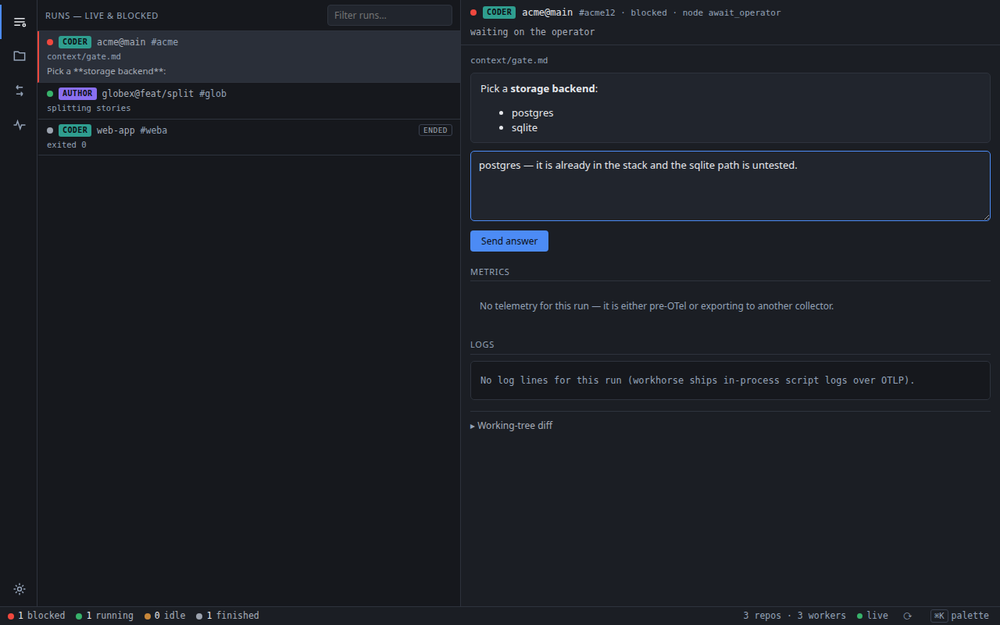
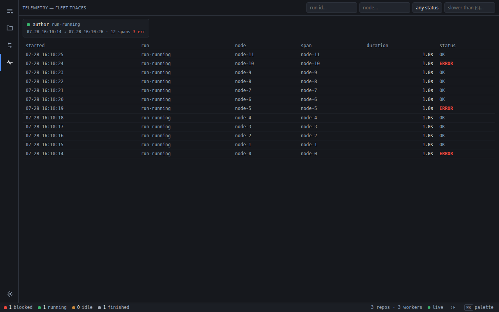

# groom

A local, single-process web dashboard for `workhorse` agent-workflow operator
gates. Run `groom serve` on your host while `author`/`coder` (or any other
`workhorse`-based workflow) containers run in the background; `groom` shows
every running workflow, pages you the moment one blocks on an operator gate,
and lets you answer the gate right from the browser — no more finding and
restarting blocked containers one by one. The shared `await_operator` node blocks in
place rather than exiting, so the container keeps running; the answer travels
over the run's own workhorse control socket and the run wakes at once, with the
gate file kept as the durable record (and as the fallback channel when nothing
is listening); `groom` only falls back to `docker start` if a container has
genuinely stopped.



Beyond the gates, the same dashboard is the fleet's telemetry reader — every run's
spans, per-node timings and error status, filterable without leaving the browser:



## How it works

- Each workflow container runs a tiny in-container sidecar, `groom-sidecar`,
  that watches its own `/workspace` and `/runs` mounts (via `watchfiles`, so the
  container gets inotify and a developer's macOS or Windows box still works) and holds
  one persistent WebSocket open to the host's `groom` (dialing out over
  `host.docker.internal`, so no inbound reachability is needed). It advertises
  full state on connect, streams `progress`/`blocked`/`turn` deltas, and serves the
  Files/Diff panels from local disk via `getTree`/`getFile`/`getDiff` RPC over
  the same socket — plus `listTurns`/`readTurnFile`, through which the host pulls
  the container's turn records into its archive before the volume is destroyed,
  and `getQuestions`/`answerGate`, through which the host talks to the run's
  workhorse control socket: list what a run is blocked asking, and deliver the
  operator's answer straight into the waiting process.
  The connection is best-effort and re-syncs on reconnect —
  a container with no `groom` listening behaves the same. See the repository's
  [`sidecar-live-sessions.md`](https://github.com/GabrielCpp/stablemate/blob/main/docs/features/groom/sidecar-live-sessions.md)
  for the message schema and the local `reload` development loop.
- `groom` holds live fleet and browser state in memory and pushes
  JSON state to open browser tabs over a websocket; the browser renders it with
  Preact + htm (the vendored `htm/preact` standalone build — no build step, no
  `node_modules`). Every shape the socket pushes is also fetchable over HTTP, so a
  tab whose socket has gone quiet resyncs instead of going stale.
  Those pushes are edge-triggered — something changed, so tell the
  tabs — which covers everything except the half of a run row that is derived from
  the clock: the liveness dot, `silent 4m`, `in node 12m`. The event that should
  turn a row dead is the run *ceasing* to emit, and an absence cannot be pushed, so
  the run list is additionally re-rendered and broadcast every `GROOM_LIVE_TICK_S`
  (5s), skipped entirely when no tab is connected. That is what makes the dashboard
  safe to leave open and read without refreshing.
- That same tick reads **local-host evidence that a native run has ended**, so a dead
  run stops looking alive without waiting out the silence window. A native run shares
  groom's host by definition, which makes two facts directly observable that no export
  can be relied on to deliver: the `terminal` the run wrote into its own `run.json`
  (on disk the instant it stops, whereas the root span only lands if the dying process
  got its exporter flushed), and whether the run's pid still exists (the only witness
  left after a SIGKILL, an OOM, or a segfaulting extension, where nothing is written
  at all — reported as `died`, rather than borrowing a word the run never reached).
  Without this the remaining signal is silence, and silence is deliberately slow
  (`GROOM_LIVE_AFTER_S`, 180s): three minutes of a green *running / alive* row on
  exactly the failure an operator is watching for. The verdict stamps the same
  `terminal` a root span would, so the dot and the liveness chip cannot disagree, and
  it clears itself on the next newer signal — a `--resume-run` re-writes `run.json`
  with a null terminal before it does anything, so a resumed run goes back to green.
  Gate questions render as Markdown (`marked`, sanitized with
  `DOMPurify` before insertion since the content is LLM-authored); a *Full
  context* disclosure under the question fetches the whole gate file through
  `/file/` and renders it the same way, so the findings and earlier escalations
  around the question are read in the dashboard rather than hunted for on disk;
  and each workflow row can expand a `git diff` of its working tree (rendered
  with `diff2html`). All front-end assets are vendored locally; nothing is loaded
  from a CDN at runtime.
- Gates travel over the run's control socket, with the file as the record. An
  answer goes socket-first — `groom` asks the run what it is waiting on and
  delivers the answer on the run's own path spelling; the run persists it into
  the gate file before acknowledging — and falls back to writing the gate file
  from outside only when nothing answers on the control socket.
  Discovery is a periodic *questions poll* of every live run's socket, so the
  push arms (the sidecar `blocked` frame, `/push/blocked`, the hello snapshot)
  are just hints that trigger an immediate poll: a push that never lands is
  healed by the next poll cycle, never lost.
- On startup (or on-demand refresh), `groom` runs a one-shot `docker ps -a` +
  `docker inspect` reconciliation scan so workflows that were already
  blocked before `groom` was started are still picked up.

## Install

groom is not on PyPI (that name belongs to an unrelated project), so install it from a
checkout of the [stablemate](https://github.com/GabrielCpp/stablemate) workspace:

```bash
pipx install ./groom        # isolated CLI on your PATH
```

Requires Python ≥ 3.12. groom is an optional add-on — no base workflow requires it — and
nothing has to be configured on the workflow side: `workhorse` probes for a collector at
the default port when a run starts, and containers dial out to it on their own.

## Usage

```bash
groom serve                       # binds 127.0.0.1:8787 — loopback only, the default
groom serve --host 0.0.0.0       # all interfaces: required for containerized runs (see note)
```

From a checkout of this workspace, prefix each command with `uv run` (`uv run groom serve`)
to use the working tree instead of the installed copy.

> **Binding.** groom binds loopback by default because it has **no
> authentication** — it controls docker and answers operator gates. The
> in-container `groom-sidecar`s reach the host over the docker bridge
> (`host.docker.internal` → the bridge gateway on Linux, not loopback), so
> containerized runs need `--host 0.0.0.0` — an explicit choice that prints a
> one-line exposure warning (`--allow-non-loopback` acknowledges it). Only do
> that on a trusted network.

## Telemetry collector (OTLP) + AFK alerting

`groom` is also the default local **OpenTelemetry collector** for `workhorse`
runs. The same uvicorn process
and port expose standard OTLP/HTTP receivers — `POST /v1/traces`,
`POST /v1/metrics` and `POST /v1/logs` — so an ordinary run

```bash
workhorse-coder run                # probes the endpoint at start; exports if groom answers
```

(No env var is needed while `groom serve` is up on the default port — workhorse
enables telemetry when it finds a collector listening. Point elsewhere with
`OTEL_EXPORTER_OTLP_ENDPOINT`, or opt out with `WORKHORSE_OTEL=0`.)

It streams node/agent-turn spans, gas/heartbeat metrics, and the log records of the
engine and every node it runs in-process into `groom`. Because a
pushed span carries its own identity, **native (non-Docker) runs appear too** —
no discovery gate. Spans and metrics persist in an embedded SQLite file
(`groom.db` in the platform data dir; override with `GROOM_DB`), searchable
from the dashboard's *Telemetry* pane, via `GET /traces?run=…&node=…&status=…&
slower_than=…`, or with raw `sqlite3` queries. Rows older than
`GROOM_RETENTION_DAYS` (14) are pruned at startup and on a periodic tick.

A batch the store cannot take is answered `503` with a `Retry-After`, not `500`: the
exporter re-sends it, where an unhandled error would have said "stored" by omission.
That is a deliberate trade of duplicates for losses — `spans` and `turns` are keyed and
absorb a re-send, `metrics` and `logs` are plain appends and a retried batch can land
twice. Duplicate rows are cosmetic in tables read by recency; a dropped batch is gone.
The connection behind it recycles itself on a SQLite error and retries once, so a
wedged handle heals on the next request instead of at the next restart. Whether any of
that has happened is in `GET /api/state` under `store` — `reopens`, `failures`,
`last_error`, and `ok`, which is false only while a failure is *newer* than the last
statement that worked.

The liveness counters — `workhorse.run.heartbeat`, `workhorse.turn.heartbeat`,
`workhorse.cap_wait.heartbeat` — are **never stored at all**: `insert_metrics`
drops them at the door. They tick every ~10s for every open node, so
on long runs they outgrow everything else combined: in one real store the run
heartbeat alone was 1.77M of 2.21M metric rows, and a later one hit 2.8 GB with
heartbeats ~80% of 18M rows. Nothing reads their history — the alert rules fold
them into memory at ingest, and `groom status` asks the running server for that
in-memory picture over HTTP (`/api/live`) — so persistence bought nothing and
cost most of the file. (`GROOM_LIVENESS_RETENTION_DAYS`, 1, remains as the prune
knob that drains rows written before this change.) The gauges
(`turn.active`, `turn.idle_s`, `wait.active`, `wait.elapsed_s`, `node.elapsed_s`,
`node.active`) keep the normal window: climbing idle on an active turn diagnoses a
wedged agent, while an explicit wait is expected parked work.

**The pane shows the runs connected right now.** Two weeks of retention means the
unfiltered strip is mostly runs that ended days ago, and a dashboard is for
watching, so a run card (and its spans — a span table listing a hidden run's nodes
is telemetry from nowhere) appears only while the run is `live` by the same
heartbeat predicate the fleet rows use. History is one tick of *show ended* away
(`GET /traces?show_ended=1`), and searching an explicit `run=` always finds it:
naming a run is asking for that run, finished or not.

**Native runs are first-class dashboard rows, not just telemetry.** A run on
groom's own host advertises its `run_dir`, workspace path, pid, and per-node
`activity` label on the OTLP resource; groom materializes a fleet row from that
(keyed by `run_id`), shows what it is doing ("coder · reviewing ACME-A2JX"), and —
because it shares the host — serves the row's Files/Diff panels and answers its
operator gates straight from the local filesystem (`groom.localfs`), no docker
volume or sidecar needed. The native test is self-validating: groom draws the row
only for a run whose `run_dir` it can actually read locally, so a containerized
producer (whose paths don't resolve on the host) never double-lists.

Alert rules run on every ingest plus a periodic tick, and page you through
browser notifications **and** an away-from-keyboard push — configure
`GROOM_NTFY_TOPIC` (posts to `https://ntfy.sh/<topic>`; override the server
with `GROOM_NTFY_URL`) and/or `GROOM_WEBHOOK_URL` (JSON `{"title","message"}`):

| Rule | Fires when | Knob (default) |
|---|---|---|
| STALL | a live run emits **nothing** — no span, no heartbeat | `GROOM_STALL_MIN` (90) |
| STUCK | a live agent turn is silent too long, or deterministic work has sat in one node too long; explicit waits are excluded | `GROOM_STUCK_MIN` (75) |
| CHURN | the same node span completes again and again under an unchanged `labels()` signature — i.e. on the same unit of work. A visit a live reload cut short (`workhorse.cut`) is an interruption, not a repeat, and does not count | `GROOM_CHURN_REPEATS` (5) |
| WATCHDOG | a `watchdog_kill` span event arrives | — |
| GAVE-UP | a give-up node's span arrives | `GROOM_GIVEUP_NODES` (qa_give_up,fix_give_up) |
| ENDED | the run's root span arrives — the run is over, whatever the verdict, and nothing is executing for it now | — |
| DIED | a **native** run's pid is gone and it left no terminal anywhere — killed, OOM'd, or crashed hard enough to lose both the checkpoint write and the telemetry flush | — |
| BLOCKED | an operator gate opens — the run is parked until someone answers it. A cap wait does not count | — |
| WAITING | that gate is still unanswered later | `GROOM_WAIT_MIN` (30) |

Groom deliberately does not alert on total run age: resumptions reuse a run identity and multi-day
runs are normal. Use workhorse's `WORKHORSE_MAX_RUNTIME_S` when a run needs a hard wall-clock limit.

The crux: workhorse **heartbeats** for as long as its process lives, so silence
and slowness are different observations. STALL means the run stopped emitting
(dead/killed/frozen); STUCK means it is alive and parked. Alerts dedupe per
`(run, rule)`.

ENDED covers the case neither absence rule can, because a terminal is precisely
what retires a run from both of them: the run *finished*. That is the loudest
event on a queue — nothing is executing until someone launches the next run — and
until it existed it was the only one that paged nobody. It fires on every ending,
naming the terminal and the error class, because from outside "it crashed" and
"it succeeded" are the same silence. A resume reuses the run id and clears the
fired set, so the next session's ending pages on its own.

DIED is ENDED for the run that never got to say so. ENDED hangs off the root
span, and a root span only exports if the dying process flushed its exporter —
so the one class of death worth waking someone for (SIGKILL, the OOM killer, a
segfaulting extension) was the single ending that reached nobody. The dashboard
row already went grey on it, because a native run shares groom's host and its pid
is directly observable; the row was just the only place it was ever said. It is
native-only for that same reason: a containerized run's pid is in another
namespace, and the sidecar reports its exit.

The alert names a run directory that now also holds the command to bring it back:
workhorse writes a `launch.json` beside `run.json` whose `resume_argv`, run from the
recorded `cwd`, resumes the run in place off its last checkpoint. groom does not run
it — deciding *whether* a killed run should be restarted is a policy question, and an
OOM-killed run restarted on the same box gets OOM-killed again — but the page and the
command are now in the same place.

BLOCKED and WAITING cover the mirror image: a run parked on an operator gate is
behaving correctly, so no rule described it, and STUCK skips an open wait by
design. Yet it is the only alert whose subject can end it — the human reading the
page *is* the missing input. Answering the gate closes the wait and retires both.
Run `groom serve` under nohup/systemd as the always-on collector
(the consuming repo's `make groom-serve` target does exactly that).

## Where is my run right now?

Spans export **on completion**, so a run's current node — the only one that
matters when it will not finish — has no row in `spans` and never will while it
hangs. The live picture therefore comes from metrics, which ship on a timer
regardless of span state:

```bash
uv run groom status              # every live run: open node, node age, agent idleness
uv run groom status --run <id>   # one run
uv run groom status --json       # same data, machine-readable
```

Read it like this:

| Reading | Means |
|---|---|
| `alive`, node age small | working normally |
| `alive`, explicit wait | operator/cap/retry wait — parked deliberately |
| `alive`, active turn age large, agent `idle` small | a long but **streaming** turn — healthy |
| `alive`, active turn, agent `idle` large | **wedged** agent/tool/API inside the node |
| `alive`, no turn or wait, node age large | **wedged deterministic work** inside the node |
| no heartbeat (`DEAD?`) | the process is gone — SIGKILL, OOM, crashed host |

## What was it saying? (`groom logs`)

`status` says *where* a run is; logs say what it was doing on the way there.

```bash
uv run groom logs --run <id>                 # everything, oldest-first
uv run groom logs --run <id> --node select_item
uv run groom logs --level WARNING            # a FLOOR: WARNING + ERROR + FATAL
uv run groom logs --contains "over budget"
```

Deterministic (non-agent) nodes appear here because workhorse **runs them in-process**
and hands each one a per-node `logger`, preserving the node's decisions alongside its
spans and artifacts.

Records carry the same `run_id`/`run_dir` resource as the spans, so a log line
joins to its node span and its on-disk artifacts with no correlation step. They
are correlated by an explicit `node` attribute rather than `trace_id`, which is
zeroes: workhorse never makes its node spans current, so there is no ambient
context for the SDK to attach.

No alert rule fires on logs, deliberately — liveness is already answered by the
heartbeat metrics, and paging on log *content* would mean guessing which strings
are worth waking someone for, per workflow. Logs are for reading once a metric has
told you where to look. They prune on their own shorter window
(`GROOM_LOG_RETENTION_DAYS`, 3) because they are one row per line rather than one
per node visit.

### Test runs are not telemetry

A test suite is not a run anyone comes back to, and on a machine where
`groom serve` is up it is by far the loudest producer: one `make test` of the
workflows suite wrote a six-figure number of spans, burying every real run in
the fleet view. So test telemetry is kept out at both ends — workhorse declines
to auto-enable export from a test process (`WORKHORSE_OTEL=1` still forces it
on), and the receivers drop any record whose `run_dir` is *certainly* a test
dir — one containing `pytest-of-` or `.workhorse-test/`. Neither undoes what an
older producer already wrote:

```bash
uv run groom purge-tests --dry-run   # what would go
uv run groom purge-tests             # delete it, then VACUUM to shrink the file
```

`purge-tests` casts the wider net: it also evicts runs whose dir is a
`tempfile.mkdtemp` scratch dir (`/tmp/tmpXXXXXXXX/…`), which is how the largest
single junk run in a real store got there. That one is a guess — a genuine run
launched from a mkdtemp directory matches too — so it is confined to a command
you run deliberately and can preview with `--dry-run`, rather than to the ingest
path, where the same guess would discard evidence unasked. Runs are identified
by their run dir in both cases, never by name.

## Reading the store afterwards

The same file the dashboard reads answers the after-the-fact questions — what a run cost
and where it looped, what it would have cost on another model set, what a node actually
said, and where the wall clock went:

```bash
uv run groom cost --run <id>          # money and rework per node, with /work turns-per-item
uv run groom prices --run <id>        # re-price the same turns against another model set
uv run groom loops --run <id>         # which review→rework loops converge, and which do not
uv run groom transcript --run <id>    # the reasoning and tool trace prompt.md omits
uv run groom profile --run <id>       # what occupied the wall clock
uv run groom db-path                  # …and the SQLite file, for anything the CLI does not ask
```

Cost coverage is not uniform — it is harness × *provider*, and the two ways of not pricing
a turn (nothing reported, versus a reported `0`) differ in how visible they are. Every
command above says how much of itself is real rather than presenting a partial sum as a
complete one.

Those commands, the schema and its one footgun, and worked SQL are in
[docs/STORE.md](docs/STORE.md).

See `docs/features/groom/` at the repo root for the full design — groom's own OKF book,
queryable with `ostler graph --surface groom`.
